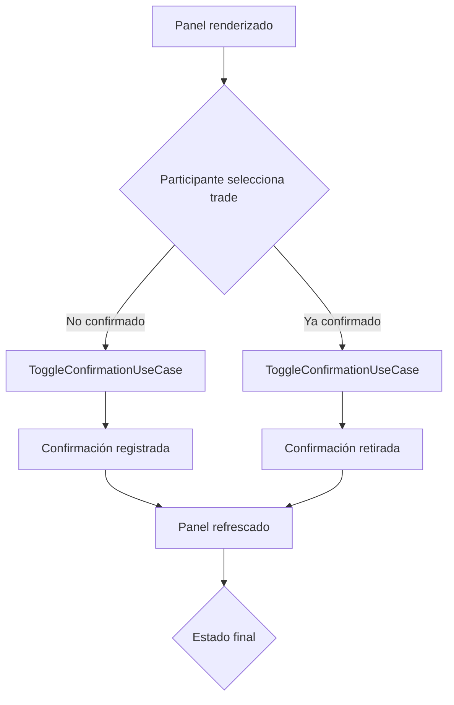
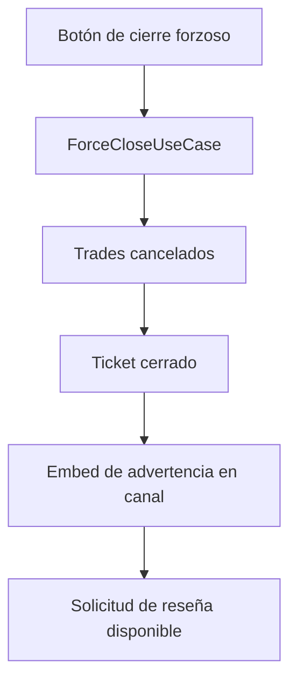

# Middleman Panel & Workflow

El sistema de middleman ofrece un panel interactivo para gestionar los tickets reclamados, confirmar participantes y cerrar transacciones. Esta guía resume los comandos disponibles, la estructura del panel y las estrategias de logging para operar el flujo de principio a fin.

## Slash commands

| Comando | Contexto | Descripción |
| --- | --- | --- |
| `/middleman panel` | Canal del ticket | Renderiza un panel efímero con el estado de cada trade, botones de administración y selector para confirmar/cancelar. |
| `/middleman stats` | Canal del ticket | Muestra un embed con el conteo actual de trades por `TradeStatus` (PENDING, ACTIVE, COMPLETED, CANCELLED). |
| `/middleman review` | Canal del ticket | Reenvía el recordatorio de reseña al canal del ticket (requiere que el ticket esté cerrado). |
| `/middleman force-close` | Canal del ticket | Ejecuta un cierre forzoso marcando las transacciones como canceladas y notificando en el canal. |

> ℹ️ Todos los subcomandos requieren que el usuario sea el middleman asignado o participante del ticket, salvo `/middleman force-close` que solo acepta al middleman reclamante.

## Panel interactivo

El panel efímero renderizado por `/middleman panel` incluye:

- **Resumen de estados**: recuento por `TradeStatus` y detalle por participante.
- **Selector de confirmación**: menú desplegable con cada trade. Seleccionar una opción alterna la confirmación del usuario actual.
- **Acciones disponibles**:
  - 🔁 `Actualizar panel`: vuelve a consultar la base de datos y sincroniza el embed.
  - 📦 `Enviar resumen`: publica un embed en el canal con la lista de confirmaciones registradas.
  - ⭐ `Recordar reseña`: reenvía el mensaje de recordatorio (solo tickets cerrados).
  - 🛑 `Cierre forzoso`: cancela las transacciones pendientes y cierra el ticket marcándolo como `forcedClose`.

Cada acción emite respuestas efímeras idempotentes, de modo que pulsar repetidamente un botón no duplica efectos en la base de datos ni mensajes en el canal.

### Diagrama de flujo (simplificado)

## Longitudes y formatos

- **Nombres de items**: se recomienda limitar a 80 caracteres. El selector muestra `label` y `description`, por lo que textos más largos se truncarán en Discord.
- **Descripciones del panel**: el resumen se mantiene por debajo de los 2000 caracteres para evitar errores API. El panel se actualiza dinámicamente, por lo que si se detecta un overflow se recorta en el servidor antes de enviarse.
- **Mensajes de confirmación**: los embeds enviados al canal (resumen de finalización y recordatorio de reseña) evitan saltos de línea consecutivos y formatean las fechas con `toLocaleString('es-ES')` para consistencia.

## Estrategia de logging

Todos los casos de uso registran eventos clave con `pino`:

- `RenderPanelUseCase` emite logs `debug` con el conteo de estados y el ID del solicitante.
- `ToggleConfirmationUseCase`, `SendFinalizationUseCase`, `RequestReviewUseCase` y `ForceCloseUseCase` registran `info`/`warn` indicando `ticketId`, `actorId`, `channelId` y si la acción fue confirmada, retirada o forzosa.
- Los errores controlados se transforman en respuestas efímeras y no generan trazas extensas; los errores inesperados se capturan en `interactionCreate` y emiten un log con `referenceId` para correlación.

Mantén los niveles (`debug`, `info`, `warn`) para filtrar rápidamente durante auditorías sin saturar el log con ruido en producción.
